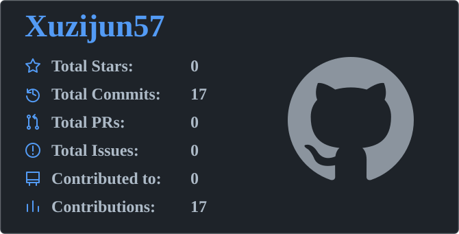

# Xuzijun57

I study physics at Fudan University, with interests in condensed matter physics and AI for physics.

I am currently studying classical mechanics, electrodynamics, quantum mechanics, and thermodynamics and statistical mechanics. My current collaborative project focuses on LLM evaluation for Physics Olympiad problems and data synthesis.

Contributions covers all years and includes anonymous private activity when enabled in GitHub profile settings. The other five figures show public activity; contributed repositories cover the past year.

<!-- aggregate:start -->
Visible contributions across all years **17**, including commits and other contribution types. Private activity is included only when GitHub exposes anonymous private contributions.
<!-- aggregate:end -->
